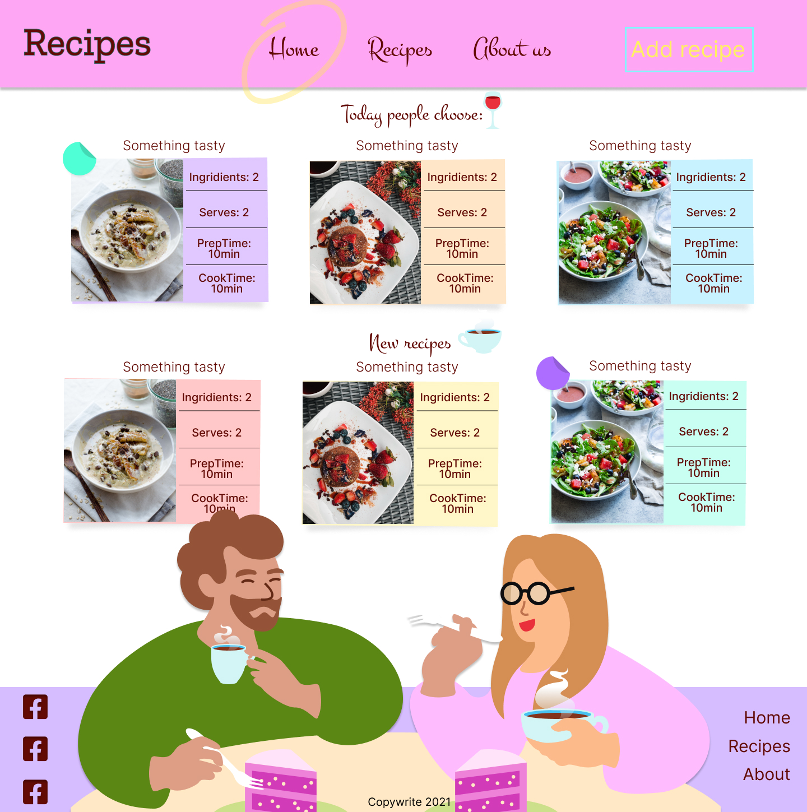

# Recipe App is a school project for create-react -app. It is implemented as a single page application with inner Routes. Written on Javascript (JSX)

## Technologies used

### Built with:

- React
- JavaScript
- PHP
- Symfony
- MaterialUI
- HTML
- CSS



Figma :[ here](https://www.figma.com/file/tyHVI7ZkOVrAd0POmy3qfO/Recipes?node-id=0%3A1);

live page is [here](https://recipes-web-app-eta.vercel.app/)

backendserver (Heroku) [here](https://lit-sierra-74086.herokuapp.com/recipe/all)

### I will lovely use it as my own home cook book to write down the recipes i use and like in my daily life.

#

### it is open source. Clone it and

```js
npm install
npm install react-router-dom
npm install axios
npm-install json-server --save-dev
npm-install @material-ui/core
npm-install @material-ui/icons
```

#

### Authors and acknowledgment:

### Julia Matvi

GitHub @jualiasha

[LinkedIn](www.linkedin.com/in/jualiasha)
